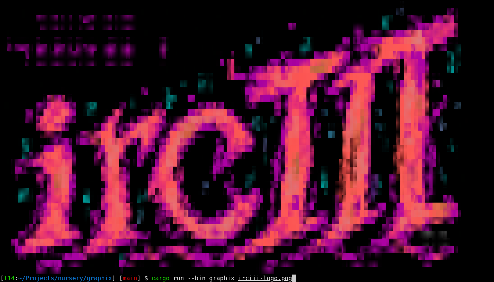
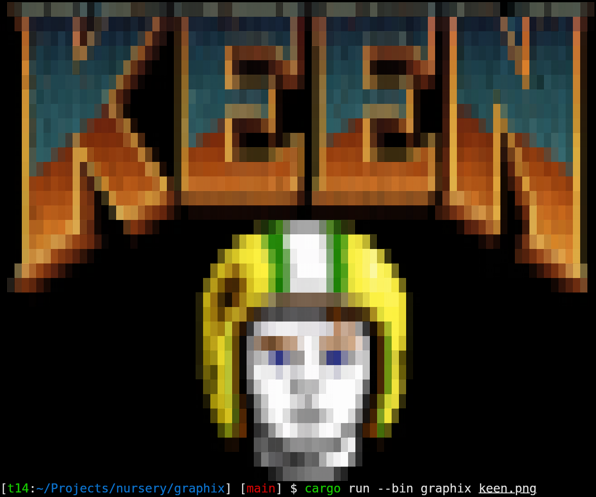

# graphix

Render PNG images as 24-bit ANSI block art in the terminal.

`graphix` takes a PNG input image and produces artwork made of 24-bit ANSI
colors and Unicode block or dot characters, sized to fit the current
terminal.

```sh
graphix image.png               # fit to the current terminal size
graphix image.png -w 80         # constrain to 80 columns
graphix image.png -w 80 -H 24   # constrain to 80x24 cells
graphix image.png -m half-block # square pixels instead of shade blocks
graphix image.png -m octant     # finest 2x4 solid-fill matrix per cell
```

## Rendering modes

Five granularity layers are supported, in increasing resolution, drawn from
four Unicode blocks. Every mode splits a cell's source pixels into a dark
and a light cluster by mean luminance; the two cluster averages become the
cell's background and foreground colors. What differs is how much detail
the glyph itself carries within the cell:

- **`shade`** (default) — the shade characters `░▒▓█` from *Block Elements*
  (U+2580..U+259F). The shade is chosen so its foreground coverage (`░`
  25%, `▒` 50%, `▓` 75%, `█` 100%) approximates the light cluster's share
  of the region. One coverage value per cell; universal font support.
- **`half-block`** — the upper half block `▀` from *Block Elements*. Since
  a terminal cell is about twice as tall as it is wide, each cell shows two
  square pixels: the top half is the foreground color, the bottom half the
  background, each averaged exactly from its own pixels.
- **`sextant`** — *Block Sextants* (U+1FB00..=U+1FB3B), a 2x3 solid-fill
  matrix per cell. Broadly supported; subcells are slightly wider than tall.
- **`braille`** — *Braille Patterns* (U+2800..=U+28FF), a 2x4 *dot* matrix
  per cell. The 1:2 cell aspect makes each dot cover a square region; dots
  are raised where a subregion is nearer the light cluster. Universal font
  support, with visible gaps between the dots.
- **`octant`** — *Block Octants* (U+1CD00..=U+1CDE5, added in Unicode
  16.0), a 2x4 *solid-fill* matrix per cell — the finest layer, matching
  braille's resolution without the dot gaps. Font support is still sparse;
  unsupported glyphs render as tofu.

Both `sextant` and `octant` reuse the *Block Elements* half and quadrant
glyphs for the patterns those blocks already encode, since Unicode omits
them from the sextant and octant ranges.

## Library

Everything the binary does is exposed as a library; the CLI is argument
parsing plus one call:

```rust
let (cols, rows) = graphix::terminal_grid();
let art = graphix::render_file("image.png", cols, rows, graphix::Mode::Shade)?;
print!("{art}");
```

The lower-level pipeline (`fit_grid` → `render_cells` → `to_ansi`) is also
public, and the `image` crate is re-exported for constructing images
without adding it as a separate dependency.

## Examples



